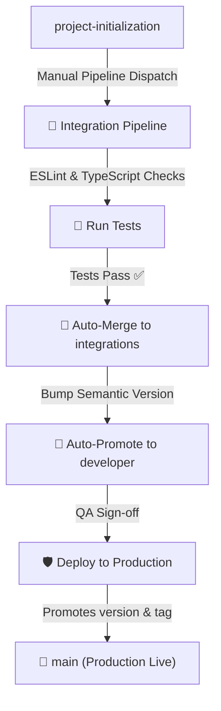

# 🏥 Braam Health NFS Centre

> Fully Custom Membership & Clinic Management System centralizing patient data, secure role-based access control, and administrative workflows under the NFS umbrella.
> Live Reference: [Braam Health Centre](https://braamhealthcentre.nfsconnect.co.za/)

---

## 🎯 1. Project Objective

The **Braam Health NFS Centre** system is designed to provide a cohesive digital environment to:
* 🗃️ **Centralize clinic-related records** in a structured, accessible database under NFS.
* 🛡️ **Enforce role-based access control** ensuring that staff and administrators only see patient records and options relevant to their permissions.
* 👥 **Manage member (patient/client) details** dynamically, tracking interaction logs and healthcare services.
* 📈 **Improve operational efficiency** with a unified digital dashboard offering real-time data insights.
* 🚀 **Ensure seamless scalability** for future clinics, medical staff, or new administrative modules.

---

## 🔍 2. System Scope

### 2.1 Membership Management System
* **Member Onboarding:** Clean registration screens for new members, capturing key personal details, medical identifiers, and contact information.
* **Structured Central Database:** A robust and secure data model storing members and their histories.
* **Advanced Records Utility:** Fast, real-time search, filter, and pagination capabilities for staff to locate, view, and update records quickly.

### 2.2 Role-Based User System
* **Admin Users:**
  * Full system control and oversight.
  * System configurations, settings management, and access levels control.
  * Reporting summaries (registrations, clinic metrics) and employee assignment audits.
* **Clinic Staff Users:**
  * View assigned member information and health histories.
  * Record clinical interactions, services rendered, and update active member cards.
  * Restrict access to administrative configurations or unauthorized sensitive patient data.

### 2.3 Secure Access Layer
* **Role-Based Authorization (RBAC):** Strict front-end page protection and secure back-end API route control.
* **Controlled Session Handling:** Secure JSON Web Tokens (JWT) or session cookies for access.
* **Data Privacy Compliant:** Ensuring medical records are handled with maximum confidentiality.

### 2.4 Administrative Dashboard
* **Dynamic Overview:** High-level dashboard cards illustrating system activity (member counts, active visits, role distributions).
* **Staff & Role Management:** Comprehensive management tools to onboard staff, edit permissions, or suspend access.
* **Data-Driven Reporting:** Exportable statistics and visual chart summaries for clinical and administrative decision-making.

---

## 🏗️ 3. Tech Stack

* **Front-end Library:** React 19 (TypeScript)
* **Development Server & Bundler:** Vite 8
* **Styling Engine:** Premium Vanilla CSS for custom, optimized branding
* **Quality Assurance:** ESLint + TypeScript strict checks + Mock test suite
* **CI/CD Orchestration:** GitHub Actions

---

## ⚙️ 4. Local Development

### 4.1 Prerequisites
Make sure you have Node.js (v20+) and npm installed.

### 4.2 Installation
```bash
# Clone the repository
git clone https://github.com/BooiBotle/braam_healthNFS.git
cd braam_healthNFS

# Install dependencies
npm install
```

### 4.3 Scripts
```bash
# Start development server
npm run dev

# Run ESLint validation
npm run lint

# Validate TypeScript compilation
npm run typecheck

# Run the integration test suite
npm run test

# Build production bundle
npm run build
```

---

## 🛡️ 5. CI/CD & Branching Pipeline

The repository utilizes a secure, enterprise-grade branching flow to protect production environments and ensure software quality.



### 5.1 Branches Structure
1. `project-initialization` (or any `feature/*` / `bugfix/*` branch): Branches where development takes place.
2. `integrations`: Branch accumulating all green, tested changes before release.
3. `developer`: Staging branch containing the stable, versioned version ready for final release QA.
4. `main`: Production-level code. Directly matches the live site.

### 5.2 Available Pipelines

#### 1. 🏥 Braam Health Integration Pipeline
* **Trigger:** Manually triggered when a feature branch (e.g., `project-initialization`) is stable and ready.
* **Actions:**
  1. Installs dependencies and runs code build (`npm run build`).
  2. Executes ESLint and TypeScript code-quality checks (`npm run lint` and `npm run typecheck`).
  3. Executes integration tests (`npm run test`).
  4. **Auto-Merges** target branch into the `integrations` branch on success.
  5. Calculates the semantic version (MAJOR for features, MINOR for systems, PATCH for bugs) and **promotes** the codebase to the `developer` branch.
  6. Generates a developer release tag (e.g., `v1.0.0-dev`).

#### 2. 🏥 Deploy Braam Health to Production
* **Trigger:** Manually triggered to promote `developer` (Staging) to `main` (Production).
* **Actions:**
  1. Mandates entry of the string `DEPLOY` for double-safety check.
  2. Runs final build checks and tests.
  3. Merges `developer` branch into the `main` branch.
  4. Commits the official production semantic version tag (e.g., `v1.0.0`).
  5. Records the release update details into the database.
